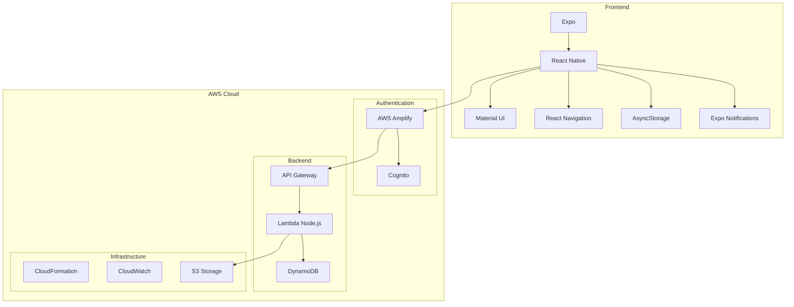
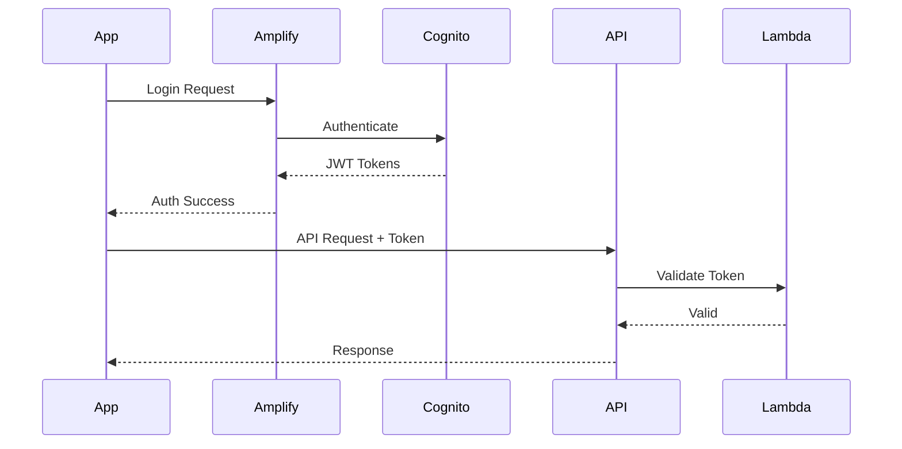
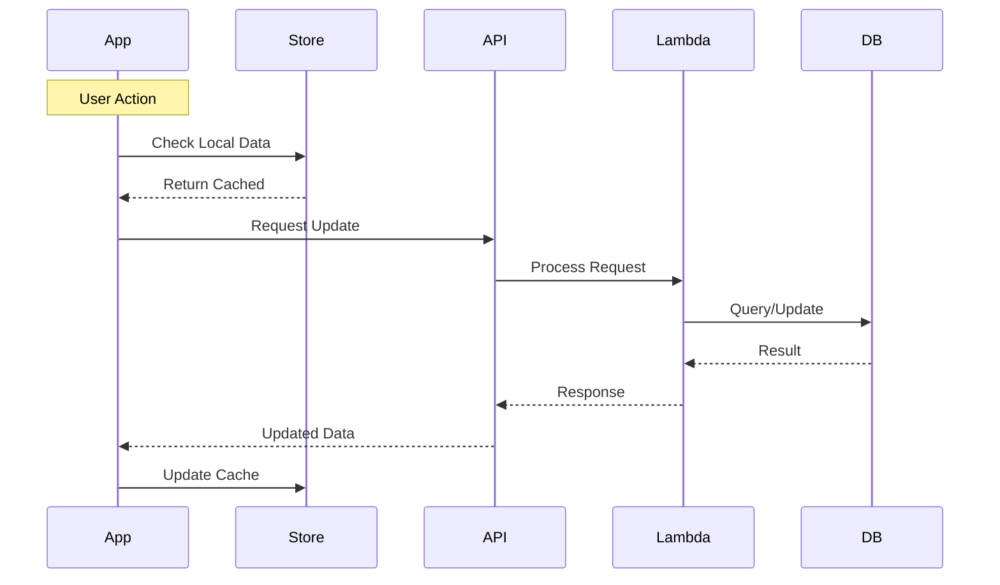
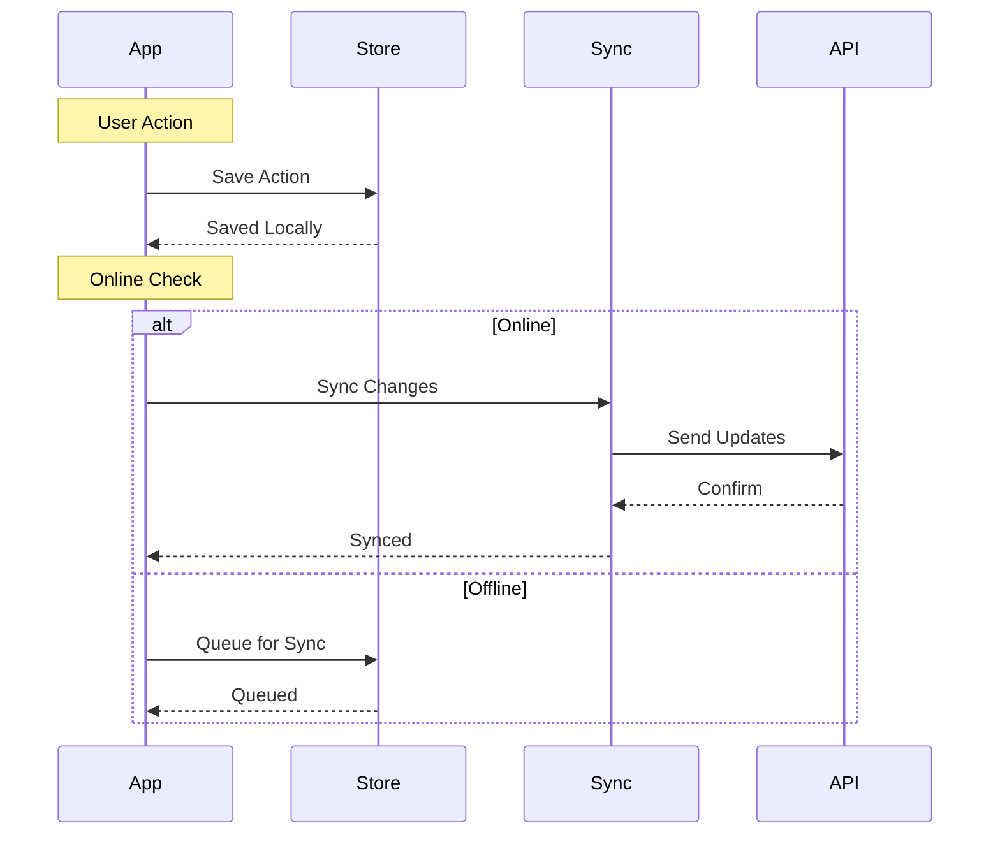
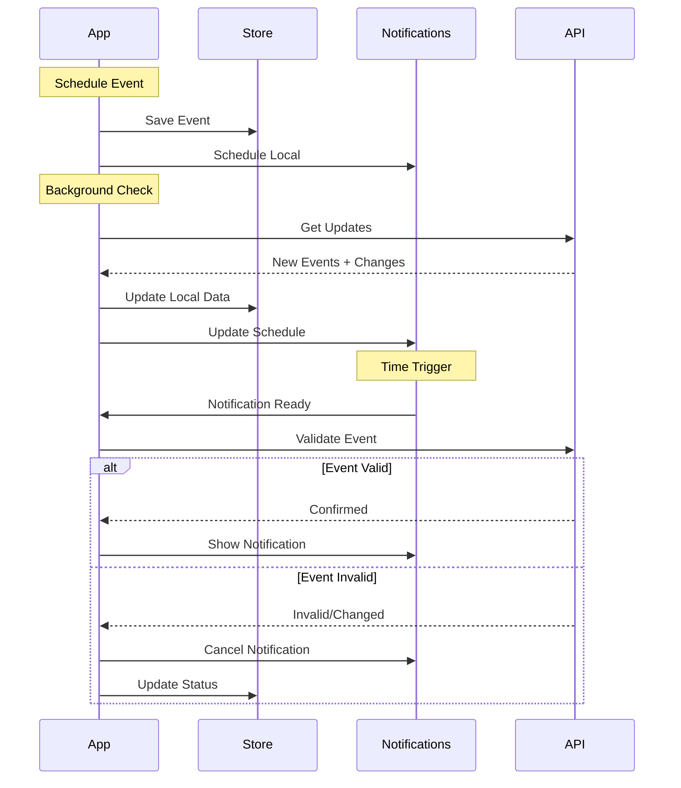

# Application Flow

## Overall Architecture

```mermaid
graph TB
    subgraph Frontend
        E[Expo]
        RN[React Native]
        MUI[Material UI]
        Nav[React Navigation]
        Store[AsyncStorage]
        Notif[Expo Notifications]
    end

    subgraph AWS Cloud
        subgraph Authentication
            Amp[AWS Amplify]
            Cog[Cognito]
        end

        subgraph Backend
            API[API Gateway]
            Lambda[Lambda Node.js]
            DB[DynamoDB]
        end

        subgraph Infrastructure
            CF[CloudFormation]
            CW[CloudWatch]
            S3[S3 Storage]
        end
    end

    E --> RN
    RN --> MUI
    RN --> Nav
    RN --> Store
    RN --> Notif
    RN --> Amp

    Amp --> Cog
    Amp --> API
    API --> Lambda
    Lambda --> DB
    Lambda --> S3
```

## Authentication Flow

```mermaid
sequenceDiagram
    participant App
    participant Amplify
    participant Cognito
    participant API

    App->>Amplify: Login Request
    Amplify->>Cognito: Authenticate
    Cognito-->>Amplify: JWT Tokens
    Amplify-->>App: Auth Success
    App->>API: API Request + Token
    API->>Lambda: Validate Token
    Lambda-->>API: Valid
    API-->>App: Response
```

## Data Operations Flow

```mermaid
sequenceDiagram
    participant App
    participant Store
    participant API
    participant Lambda
    participant DB

    Note over App: User Action
    App->>Store: Check Local Data
    Store-->>App: Return Cached
    App->>API: Request Update
    API->>Lambda: Process Request
    Lambda->>DB: Query/Update
    DB-->>Lambda: Result
    Lambda-->>API: Response
    API-->>App: Updated Data
    App->>Store: Update Cache
```

## Offline Support Flow

```mermaid
sequenceDiagram
    participant App
    participant Store
    participant Sync

    Note over App: User Action
    App->>Store: Save Action
    Store-->>App: Saved Locally
    Note over App: Online Check
    Alt Online
        App->>Sync: Sync Changes
        Sync->>API: Send Updates
        API-->>Sync: Confirm
        Sync-->>App: Synced
    else Offline
        App->>Store: Queue for Sync
        Store-->>App: Queued
    End
```

## Local Notifications Flow

```mermaid
sequenceDiagram
    participant App
    participant Store
    participant Notifications
    participant API

    Note over App: Schedule Event
    App->>Store: Save Event
    App->>Notifications: Schedule Local
    
    Note over App: Background Check
    App->>API: Get Updates
    API-->>App: New Events + Changes
    App->>Store: Update Local Data
    App->>Notifications: Update Schedule

    Note over Notifications: Time Trigger
    Notifications->>App: Notification Ready
    App->>API: Validate Event
    Alt Event Valid
        API-->>App: Confirmed
        App->>Notifications: Show Notification
    else Event Invalid
        API-->>App: Invalid/Changed
        App->>Notifications: Cancel Notification
        App->>Store: Update Status
    End
```
