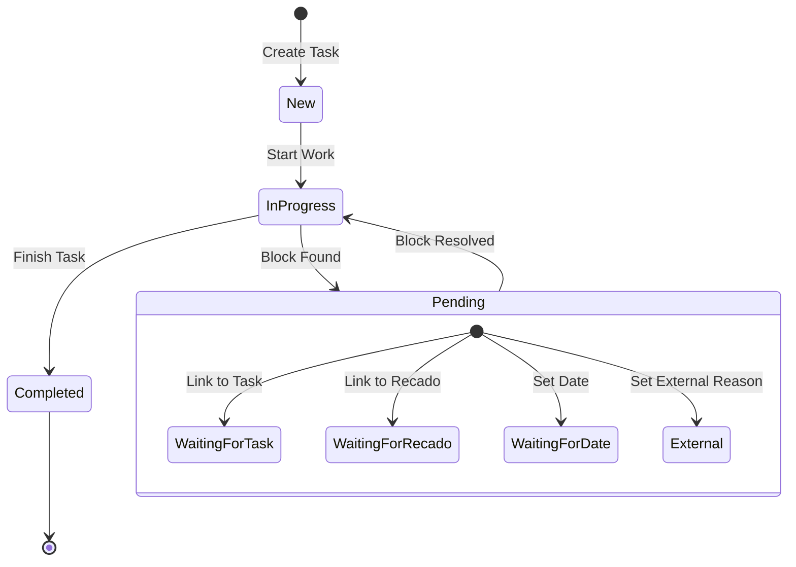
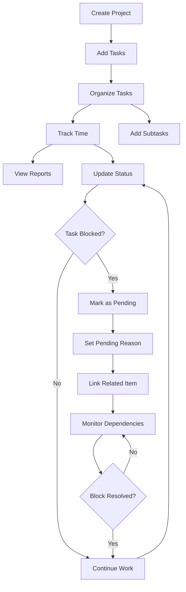
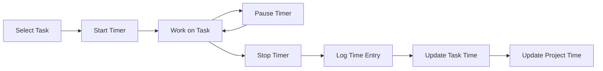
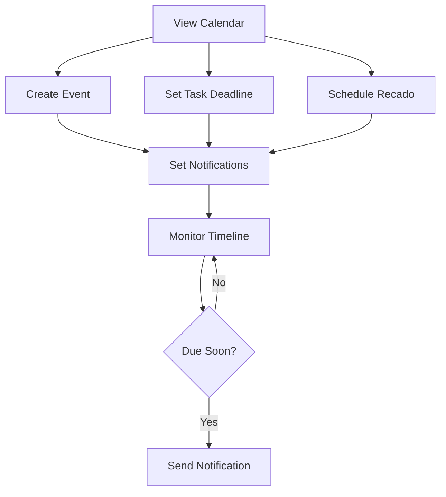

# Application Workflow

## Task Lifecycle

```mermaid
stateDiagram-v2
    [*] --> New: Create Task
    New --> InProgress: Start Work
    InProgress --> Completed: Finish Task
    InProgress --> Pending: Block Found
    Pending --> InProgress: Block Resolved
    
    state Pending {
        [*] --> WaitingForTask: Link to Task
        [*] --> WaitingForRecado: Link to Recado
        [*] --> WaitingForDate: Set Date
        [*] --> External: Set External Reason
    }
    
    Completed --> [*]
```

## Project Management Flow

```mermaid
graph TD
    A[Create Project] --> B[Add Tasks]
    B --> C[Organize Tasks]
    C --> D[Track Time]
    
    C --> E[Add Subtasks]
    
    D --> G[View Reports]
    D --> H[Update Status]
    
    H --> I{Task Blocked?}
    I -->|Yes| J[Mark as Pending]
    J --> K[Set Pending Reason]
    K --> L[Link Related Item]
    I -->|No| M[Continue Work]
    
    M --> H
    L --> N[Monitor Dependencies]
    N --> O{Block Resolved?}
    O -->|Yes| M
    O -->|No| N
```

## Time Tracking Flow

```mermaid
graph LR
    A[Select Task] --> B[Start Timer]
    B --> C[Work on Task]
    C --> D[Pause Timer]
    D --> C
    C --> E[Stop Timer]
    E --> F[Log Time Entry]
    F --> G[Update Task Time]
    G --> H[Update Project Time]
```

## Calendar Integration

```mermaid
graph TD
    A[View Calendar] --> B[Create Event]
    A --> C[Set Task Deadline]
    A --> D[Schedule Recado]
    
    B --> E[Set Notifications]
    C --> E
    D --> E
    
    E --> F[Monitor Timeline]
    F --> G{Due Soon?}
    G -->|Yes| H[Send Notification]
    G -->|No| F
```
